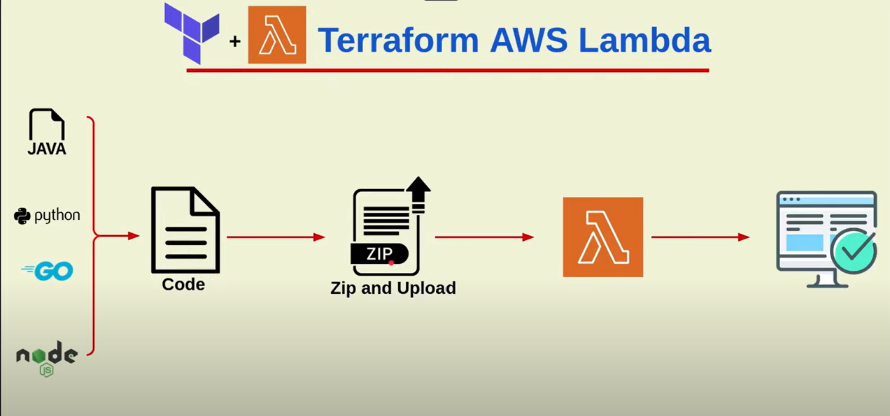

# How to deploy lambda function  using terraform
()

Step# 1
    ### Create a role for lambda    
```
  resource "aws_iam_role" "iam_for_lambda" {
  name = "iam_for_lambda"
  assume_role_policy = <<EOF
{
  "Version": "2012-10-17",
  "Statement": [
    {
      "Action": "sts:AssumeRole",
      "Principal": {
        "Service": "lambda.amazonaws.com"
      },
      "Effect": "Allow",
      "Sid": ""
    }
  ]
}
EOF
}
```

Step#2
create a  policy
```
resource "aws_iam_policy" "iam_policy" {

  name        = "test_policy"
  path        = "/"
  description = "My test policy"
  policy = jsonencode(
    {
      "Version" : "2012-10-17",
      "Statement" : [
        {
          "Effect" : "Allow",
          "Action" : [
            "logs:CreateLogGroup",
            "logs:CreateLogStream",
            "logs:PutLogEvents"
          ],
          "Resource" : [
            "*"
          ]
        }
      ]
  })
}
```

Step 3 attach policy to role 
```
resource "aws_iam_role_policy_attachment" "attachemnt_role" {
  role       = aws_iam_role.iam_for_lambda.name
  policy_arn = aws_iam_policy.iam_policy.arn
}
```

step 4 zip lambda code

```
data "archive_file" "zip_python_code" {
  type        = "zip"
  source_dir  = "${path.module}/python/"
  output_path = "${path.module}/python/hello.zip"
}
```
step 5 create a lambda function

```
resource "aws_lambda_function" "terraform_lambda_func" {
  filename      = "${path.module}/python/hello.zip"
  function_name = "python"
  role          = aws_iam_role.iam_for_lambda.arn
  handler       = "hello.lambda_handler"
  runtime       = "python3.8"
  depends_on = [
    aws_iam_role_policy_attachment.attachemnt_role
  ]
}

```
